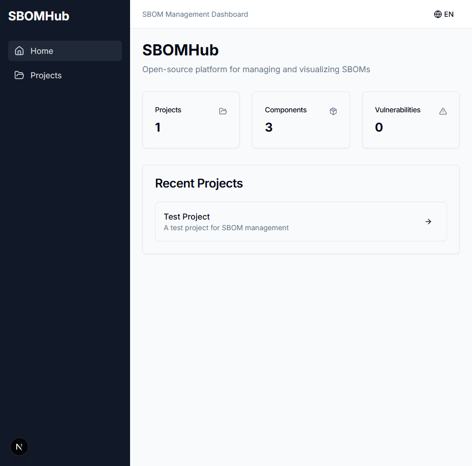
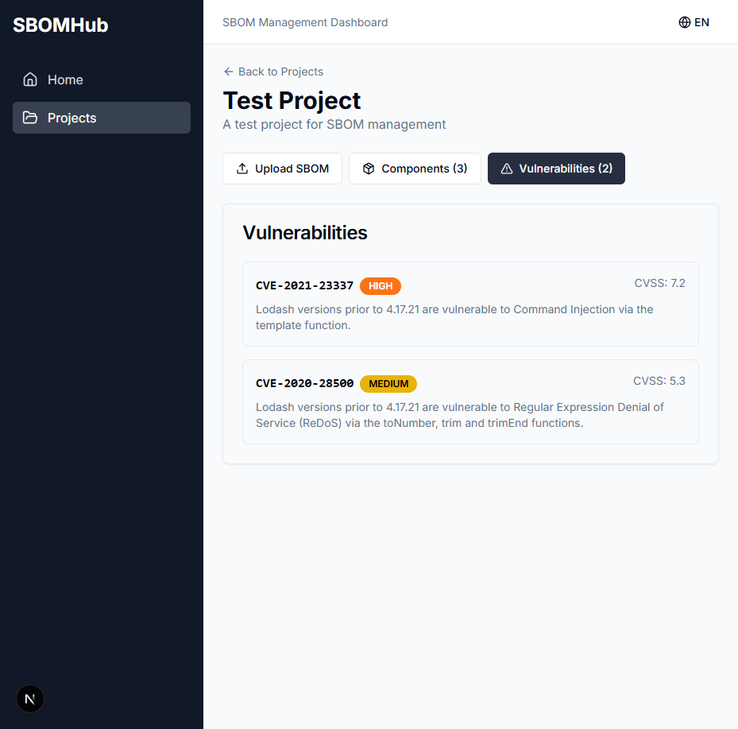
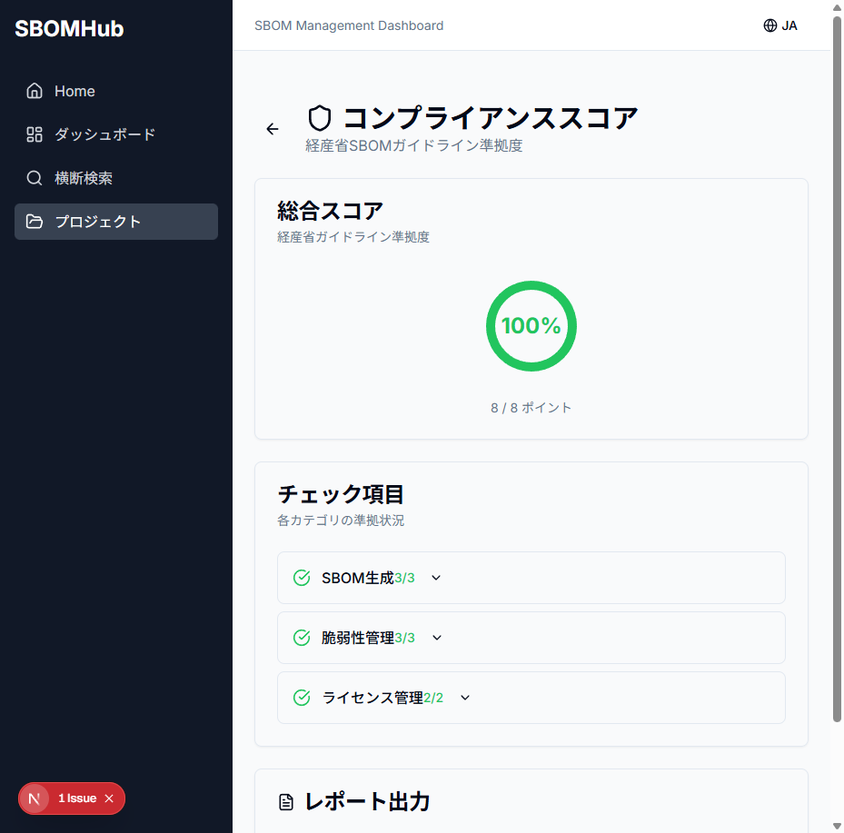

# SBOMHub

[](./README.ja.md) [](./README.md)


<p align="center">
  
</p>

## What is SBOMHub?

SBOMHub is an open-source SBOM (Software Bill of Materials) management dashboard designed for the Japanese market. It helps you:

- **Import** SBOMs from Syft, cdxgen, Trivy, and more (CycloneDX/SPDX)
- **Track** vulnerabilities with NVD and JVN (Japan) integration
- **Prioritize** with EPSS exploit prediction scores
- **Manage** VEX statements for vulnerability triage
- **Comply** with METI guidelines (Japan) and EU CRA requirements
- **Enforce** license policies across your projects
- **Alert** your team via Slack/Discord/Email

## Features

| Feature | Description |
|---------|-------------|
| Multi-format SBOM | Import CycloneDX and SPDX JSON |
| Vulnerability Tracking | NVD + JVN integration for comprehensive coverage |
| EPSS Scoring | Prioritize by exploit probability |
| VEX Support | Document vulnerability applicability |
| License Policies | Enforce allowed/denied licenses |
| Compliance Scoring | METI guideline compliance check |
| CI/CD Integration | GitHub Actions support with API keys |
| Japanese UI | Full Japanese language support |

## Quick Start

### SaaS Version (Coming Soon)

Try SBOMHub without installation: **https://sbomhub.app**

### Docker Compose (Self-hosted)

```bash
# Download and start (no clone needed)
curl -fsSL https://raw.githubusercontent.com/youichi-uda/sbomhub/main/docker-compose.yml -o docker-compose.yml
docker compose up -d
```

Or clone and run:

```bash
git clone https://github.com/youichi-uda/sbomhub.git
cd sbomhub
docker compose up -d
```

Open http://localhost:3000

### From Source

**Prerequisites:**
- Go 1.22+
- Node.js 20+ / pnpm
- PostgreSQL 15+
- Redis 7+

```bash
# Start database
docker compose -f docker/docker-compose.yml up -d postgres redis

# Backend
cd apps/api
go run ./cmd/server

# Frontend (new terminal)
cd apps/web
pnpm install
pnpm dev
```

## Screenshots

<details>
<summary>Dashboard</summary>

</details>

<details>
<summary>Vulnerability List</summary>

</details>

<details>
<summary>Compliance Score</summary>

</details>

## Architecture

```
┌─────────────────┐     ┌─────────────────┐
│   Next.js Web   │────▶│    Go API       │
│   (Port 3000)   │     │   (Port 8080)   │
└─────────────────┘     └────────┬────────┘
                                 │
                    ┌────────────┼────────────┐
                    ▼            ▼            ▼
             ┌───────────┐ ┌───────────┐ ┌───────────┐
             │ PostgreSQL│ │   Redis   │ │ NVD / JVN │
             │  (Data)   │ │  (Cache)  │ │  (APIs)   │
             └───────────┘ └───────────┘ └───────────┘
```

## API Reference

See [API Documentation](./docs/api.md)

### Core Endpoints

```
POST   /api/v1/projects              # Create project
GET    /api/v1/projects              # List projects
GET    /api/v1/projects/:id          # Get project
DELETE /api/v1/projects/:id          # Delete project

POST   /api/v1/projects/:id/sbom     # Upload SBOM
GET    /api/v1/projects/:id/components
GET    /api/v1/projects/:id/vulnerabilities
GET    /api/v1/projects/:id/vex      # VEX statements
```

## CI/CD Integration

### GitHub Actions

```yaml
name: Upload SBOM

on:
  push:
    branches: [main]

jobs:
  sbom:
    runs-on: ubuntu-latest
    steps:
      - uses: actions/checkout@v4

      - name: Generate SBOM
        run: syft . -o cyclonedx-json > sbom.json

      - name: Upload to SBOMHub
        run: |
          curl -X POST \
            -H "Authorization: Bearer ${{ secrets.SBOMHUB_API_KEY }}" \
            -F "sbom=@sbom.json" \
            ${{ secrets.SBOMHUB_URL }}/api/v1/projects/${{ secrets.PROJECT_ID }}/sbom
```

## Documentation

- [Installation Guide](./docs/installation.md)
- [Configuration](./docs/configuration.md)
- [API Reference](./docs/api.md)
- [GitHub Actions Integration](./docs/github-actions.md)

## Roadmap

- [x] SBOM Import (CycloneDX/SPDX)
- [x] NVD/JVN Vulnerability Matching
- [x] EPSS Scoring
- [x] VEX Support
- [x] License Policies
- [x] Compliance Scoring (METI Guidelines)
- [x] CI/CD Integration (GitHub Actions)
- [x] Notifications (Slack/Discord)
- [x] Multi-tenancy (Row-Level Security)
- [x] Clerk Authentication Integration
- [x] Lemon Squeezy Billing Integration
- [ ] LDAP/OIDC Authentication (Self-hosted)
- [ ] SBOMHub Cloud (Managed SaaS)

## Contributing

Contributions are welcome! Please see [CONTRIBUTING.md](./CONTRIBUTING.md) for guidelines.

## License

This project is licensed under the [AGPL-3.0 License](./LICENSE).

| Use Case | Allowed | Notes |
|----------|---------|-------|
| Self-hosted (internal use) | ✅ | No source disclosure required |
| Self-hosted (with modifications) | ✅ | Modified source must be disclosed |
| Providing as SaaS to third parties | ⚠️ | Full source code must be disclosed under AGPL |
| Official SBOMHub Cloud | ✅ | Provided by the maintainers |

> **Note**: If you want to offer SBOMHub as a commercial SaaS without AGPL obligations, please contact us for a commercial license.

## Acknowledgements

- [CycloneDX](https://cyclonedx.org/) - SBOM specification
- [SPDX](https://spdx.dev/) - SBOM specification
- [NVD](https://nvd.nist.gov/) - National Vulnerability Database
- [JVN](https://jvn.jp/) - Japan Vulnerability Notes
- [FIRST EPSS](https://www.first.org/epss/) - Exploit Prediction Scoring System
