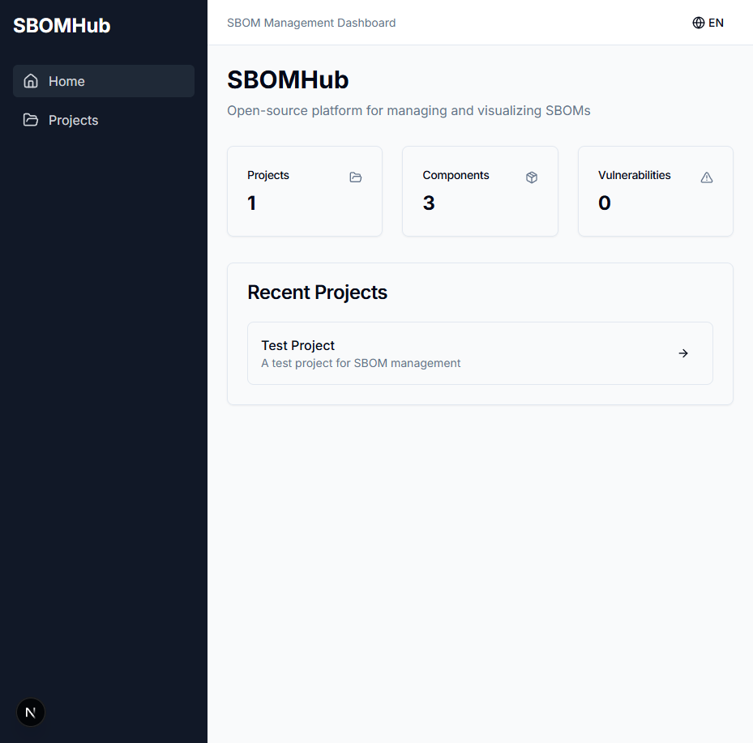

# SBOMHub

[](./README.md) [](./README_en.md)


<p align="center">
  
</p>

## SBOMHub — CRA 対応 SBOM コンプラ成果物レイヤー

> **DT は CVE を見つける。SBOMHub は、提出できる紙にする。**
>
> SBOM を、提出できる VEX・CRA 報告書・監査証跡に変える、AGPL-3.0 の OSS 運用基盤。

## 概要

SBOMHub は、CRA (EU Cyber Resilience Act) 2026/9 の脆弱性報告義務に直面する日本の組込み・IoT・中小ベンダー向けに、Syft / Trivy / Dependency-Track などの出力を取り込み、**AI が VEX・CRA 報告書・経産省自己評価の下書きを作り、人間が承認して提出物にする** 運用基盤です。

「日本市場向けの汎用 SBOM 管理ダッシュボード」というカテゴリからは撤退し、DT / Syft / Trivy の上に乗る **AI コンプラ成果物レイヤー** に再定義しました。完全オープンソース (AGPL-3.0)、セルフホスト、BYOK (Bring Your Own Key) で運用できます。

## 誰のためのものか

- EU 向けに IoT / 組込み / デジタル製品を出荷する **日本の中小製造業ベンダー**
- 専任 PSIRT を置けず、開発者や品質保証担当が片手間で脆弱性対応している組織
- 取引先や監査から SBOM / VEX 提出を求められ始めた **受託開発会社・小規模 SaaS**
- コードや SBOM を **海外 SaaS や外部 LLM API に出したくない** 製造業
- CRA 2026/9 が具体的な期限として迫っているが、専任セキュリティ担当がいない組織

汎用 SBOM 管理ツールとして広く誰にでも、ではなく、上記 ICP に絞った道具です。

## 主な機能 (実装済み)

| 機能 | 説明 |
|------|------|
| SBOM インポート | CycloneDX / SPDX JSON 取り込み |
| 脆弱性突合 | NVD + JVN 連携で日本語 CVE 情報もカバー |
| EPSS スコアリング | 悪用可能性に基づく優先度付け |
| SSVC 意思決定 | CISA SSVC フレームワークによる優先度付け |
| KEV 連携 | CISA Known Exploited Vulnerabilities カタログ自動同期 |
| VEX 管理 (手動) | CycloneDX VEX 形式の作成・編集・エクスポート |
| ライセンスポリシー | 許可 / 拒否ライセンスの管理 |
| 経産省自己評価 | 経産省「ソフトウェア管理に向けた SBOM の導入に関する手引」自己評価チェックリスト |
| 監査ログ | 操作履歴の証跡化 |
| CI/CD 連携 | GitHub Actions 例、API キー認証 |
| CLI | `sbomhub scan` / `sbomhub check` (sbomhub-cli) |
| MCP Server | Claude Desktop / Cursor などからの読み取りアクセス |
| マルチテナント | PostgreSQL Row-Level Security |
| 日本語 UI | next-intl による日本語 / 英語切替 |

## 開発中 (Phase 7: 戦略ピボット)

ここから先は AGPL-3.0 の OSS としてそのまま実装していきます。詳細マイルストーンは [sbomhub-internal/planning/PRODUCT_REBOOT_PLAN.md](../sbomhub-internal/planning/PRODUCT_REBOOT_PLAN.md) (内部) を参照してください。

- **AI VEX トリアージ MVP** (M1): CVE × コンポーネント × コードを LLM が読み、CycloneDX VEX の下書きを生成。最初は Go / npm のみ。confidence・根拠コード・アドバイザリ引用を必ず添付。
- **CRA 報告書ドラフト生成** (M2): 24 時間早期警告 / 72 時間詳細通知 / 最終報告の日本語・英語ドラフト。自動提出はしません。
- **経産省自己評価プリフィル** (M3): CI 設定 / SBOM 生成履歴 / 突合履歴から自己評価項目を自動で達成・未達・要確認に振り分け、根拠と改善アクションを表示。
- **Local LLM / Enterprise Self-host 磨き込み** (M4): Ollama 等のローカル LLM 品質向上、セルフホストセキュリティガイド整備。

絶対原則: **AI は下書きまで、最終判断は人間。** AI が勝手に `not_affected` を確定したり、CRA 報告を自動送信したりはしません。

## AI 機能と BYOK (Bring Your Own Key)

OSS 版の AI 機能は **完全 BYOK** です。SBOMHub にバンドルされた LLM 鍵はありません。お手元の OpenAI / Anthropic / Google Gemini の API キー、または Ollama などのローカル LLM を環境変数で設定して有効化してください。

サポート予定プロバイダ:

| プロバイダ | 想定モデル | コードを外部に出すか |
|---|---|---|
| OpenAI | `gpt-5` 等 | 出る (BYO key) |
| Anthropic | `claude-opus-4-7` 等 | 出る (BYO key) |
| Google Gemini | `gemini-3.5-flash` 等 | 出る (BYO key) |
| Azure OpenAI | `gpt-4o` / `gpt-5` 等 (Azure deployment 名) | 出る (Microsoft 調達契約経由) |
| Ollama (Local) | `llama3.3` / `qwen2.5-coder` 等 | 出ない (推奨) |

設定例 (`.env`):

```bash
# どれか 1 つを設定すれば AI 機能が有効化されます
SBOMHUB_LLM_PROVIDER=openai          # openai | anthropic | gemini | azure_openai | ollama
SBOMHUB_LLM_MODEL=gpt-5
OPENAI_API_KEY=sk-...
# 任意: OpenAI embedding (reachability / vector search)
# SBOMHUB_LLM_OPENAI_EMBEDDING_MODEL=text-embedding-3-small
#
# Gemini embedding は SBOMHUB_LLM_GEMINI_EMBEDDING_MODEL=gemini-embedding-2、
# Ollama embedding は SBOMHUB_LLM_OLLAMA_EMBEDDING_MODEL=nomic-embed-text で上書き可能。
# Anthropic は 2026-06 時点で first-party embedding API 非対応 (Voyage AI 等を別途利用)。

# Azure OpenAI の例 (詳細は docs/configuration.md / configuration.ja.md)
# SBOMHUB_LLM_PROVIDER=azure_openai
# SBOMHUB_LLM_MODEL=gpt-4o
# SBOMHUB_LLM_AZURE_ENDPOINT=https://my-resource.openai.azure.com
# SBOMHUB_LLM_AZURE_DEPLOYMENT=my-chat-deployment
# AZURE_OPENAI_API_KEY=...
# 任意: reachability / vector search 用の embedding deployment (M5-3)
# SBOMHUB_LLM_AZURE_EMBEDDING_DEPLOYMENT=text-embedding-3-small-prod
# SBOMHUB_LLM_AZURE_EMBEDDING_MODEL=text-embedding-3-small      # 任意; Capabilities.EmbeddingDimensions 用

# ローカル LLM の例
# SBOMHUB_LLM_PROVIDER=ollama
# SBOMHUB_LLM_MODEL=qwen2.5-coder:7b
# SBOMHUB_LLM_OLLAMA_EMBEDDING_MODEL=nomic-embed-text
# OLLAMA_HOST=http://localhost:11434
```

LLM プロバイダを設定していない場合、AI 機能は無効化され、手動 VEX 管理 / 手動 CRA 報告 / 手動経産省自己評価のみが動作します。AI なしでも従来の SBOM 管理機能はすべて使えます。

## クイックスタート

### Docker Compose (セルフホスト・推奨)

```bash
# 1. install.sh と docker-compose.yml をダウンロード (クローン不要)
curl -fsSL https://raw.githubusercontent.com/youichi-uda/sbomhub/main/install.sh \
  -o install.sh && chmod +x install.sh
curl -fsSL https://raw.githubusercontent.com/youichi-uda/sbomhub/main/docker-compose.yml \
  -o docker-compose.yml

# 2. ワンショットで全部実行
#    - .env を生成 (ENCRYPTION_KEY / MIGRATOR_PASSWORD / APP_PASSWORD をランダム発行)
#    - postgres を起動して sbomhub_app / sbomhub_migrator ロールを投入
#    - api / web / redis を起動
./install.sh --start

# 3. ブラウザで http://localhost:3000
```

ワンライナー (`curl ... | sh`) の正本は
[`docs/snippets/install.sh.md`](./docs/snippets/install.sh.md) を参照してください
(`install.sh` と手動手順の single source of truth)。

Docker image の publish CI は、API image に加えて web image も push 前に smoke test します。
web image は同一 local build を `load: true` で起動し、`http://localhost:3000` の到達性、
HTML marker、Next.js standalone runtime output (`server.js` / `.next/static`) を確認してから
同じ tag を push します。

または、リポジトリをクローンして起動:

```bash
git clone https://github.com/youichi-uda/sbomhub.git
cd sbomhub
./install.sh                              # .env を生成 (冪等)
docker compose up -d --wait postgres      # postgres を先に起動
./install.sh --bootstrap-roles            # sbomhub_app / sbomhub_migrator を作成
docker compose up -d                      # 残りを起動
```

> `./install.sh` は既存 `.env` を壊しません。再生成したい場合は `--force` を指定すると `.env.bak.YYYYMMDD` に退避してから新しい値を発行します。
>
> **既存ユーザーのアップグレード**: M0 Trust Rescue 以前のバージョンから `docker compose pull` で更新する場合は、 必ず [`docs/UPGRADE.md`](./docs/UPGRADE.md) の手順 (DB バックアップ + `./install.sh --bootstrap-roles` で既存ボリュームに新ロールを投入) を先に実施してください。 そのまま `docker compose up -d` すると api が `password authentication failed` で起動しません。
>
> **本番運用向け**: `ENCRYPTION_KEY` のローテーション手順は [`docs/encryption-key-rotation.ja.md`](./docs/encryption-key-rotation.ja.md) を参照してください (定期回転は 90 日推奨)。

### CLI (sbomhub scan)

ローカルや CI ランナーから直接スキャン・アップロードする場合は CLI を使います。

```bash
# インストール (Homebrew, macOS/Linux)
brew tap youichi-uda/sbomhub https://github.com/youichi-uda/homebrew-sbomhub
brew install sbomhub

# または Go install
go install github.com/youichi-uda/sbomhub-cli/cmd/sbomhub@latest

# 脆弱性チェックのみ (アップロードなし)
sbomhub check .
```

`login → scan → doctor` の 3 ステップ正本フローは
[`docs/snippets/cli-quickstart.md`](./docs/snippets/cli-quickstart.md) を参照。
CLI は内部で Syft / Trivy / cdxgen のいずれかを自動検出して呼び出します。
詳細は [sbomhub-cli](https://github.com/youichi-uda/sbomhub-cli) を参照してください。

### ソースからビルド

**前提条件:** Go 1.22+ / Node.js 20+ / pnpm / PostgreSQL 15+ / Redis 7+

```bash
# データベースを起動
docker compose -f docker/docker-compose.yml up -d postgres redis

# バックエンド
cd apps/api && go run ./cmd/server

# フロントエンド (別ターミナル)
cd apps/web && pnpm install && pnpm dev
```

### LLM ベンチ用バイナリ (`llm-bench`) のダウンロード

`apps/api/cmd/llm-bench` は Managed AI と Local LLM (Ollama 等) の VEX トリアージ品質を同一プロンプトで比較するための専用バイナリで、 sbomhub OSS のリリースタグごとに **スタンドアロン archive** を [GitHub Releases](https://github.com/youichi-uda/sbomhub/releases) に同梱しています (M5-2)。sbomhub のソースを clone してビルドしなくても、 `sbomhub-cli` の `sbomhub llm bench` ラッパーや CI から直接ダウンロードして実行できます。

```bash
# 例: Linux x86_64 用の最新リリースを取得 (タグは適宜置換)
VERSION=v1.4.0
curl -fsSL -o llm-bench.tar.gz \
  https://github.com/youichi-uda/sbomhub/releases/download/${VERSION}/llm-bench-${VERSION}-linux-amd64.tar.gz
tar -xzf llm-bench.tar.gz
./llm-bench --version
./llm-bench --eval-set fixtures/llm-bench/cve-20-50.json --providers openai
```

提供アーカイブ:

| OS | アーキテクチャ | ファイル名 |
|----|----------------|------------|
| Linux | amd64 / arm64 | `llm-bench-<VERSION>-linux-{amd64,arm64}.tar.gz` |
| macOS | amd64 / arm64 | `llm-bench-<VERSION>-darwin-{amd64,arm64}.tar.gz` |
| Windows | amd64 / arm64 | `llm-bench-<VERSION>-windows-{amd64,arm64}.zip` |

`checksums.txt` (SHA-256) もリリースに同梱されるので、 ダウンロード後はチェックサム検証を推奨します。 環境変数の契約 (`OPENAI_API_KEY` / `ANTHROPIC_API_KEY` / `GOOGLE_API_KEY` / `SBOMHUB_LLM_BENCH_OLLAMA_MODEL` 等) と終了コード表 (F42) は `./llm-bench --help` で確認できます。

> sbomhub OSS のサーバ本体 (`server` / `migrate`) は引き続き [Docker Hub の y1uda/sbomhub-api](https://hub.docker.com/r/y1uda/sbomhub-api) でのみ配布しています。 `llm-bench` だけがスタンドアロン archive で配布される理由は、 ラッパー (`sbomhub llm bench`) が任意のホストから単独で実行できる必要があるためです。

### SaaS 版について

> SaaS 版 (https://sbomhub.app) は **2026-06-23 時点で新規受付停止 (sunset)** です。新ポジショニング下での再開時期は未定。当面はセルフホスト + CLI を主導線にしてください。再開時はリポジトリ上でアナウンスします。

## 既存ユーザー向けの注意

SBOMHub は v0.x の間に「日本版 Dependency-Track」から「CRA 対応 SBOM コンプラ成果物レイヤー」へポジショニングをピボットしました。実装済みの SBOM 管理 / 脆弱性突合 / VEX / ライセンスポリシー / 経産省自己評価機能は維持されます。AI 機能と CRA 報告書ドラフト機能が順次追加されます。

## アーキテクチャ

```
┌──────────────────┐     ┌──────────────────┐
│   Next.js Web    │────▶│     Go API       │
│   (Port 3000)    │     │   (Port 8080)    │
└──────────────────┘     └─────────┬────────┘
                                   │
                ┌──────────────────┼────────────────────┐
                ▼                  ▼                    ▼
        ┌───────────────┐  ┌───────────────┐  ┌─────────────────┐
        │  PostgreSQL   │  │     Redis     │  │   NVD / JVN     │
        │   (Data)      │  │    (Cache)    │  │   (Vuln feeds)  │
        └───────────────┘  └───────────────┘  └─────────────────┘
                                   │
                                   ▼ (BYOK, optional)
                        ┌──────────────────────────┐
                        │   LLM Provider           │
                        │   OpenAI / Anthropic /   │
                        │   Gemini / Ollama        │
                        └──────────────────────────┘
```

## API リファレンス

主要エンドポイント (詳細は [docs/api.ja.md](./docs/api.ja.md))。

```
POST   /api/v1/projects              # プロジェクト作成
GET    /api/v1/projects              # プロジェクト一覧
GET    /api/v1/projects/:id          # プロジェクト詳細

POST   /api/v1/projects/:id/sbom     # SBOM アップロード
GET    /api/v1/projects/:id/components
GET    /api/v1/projects/:id/vulnerabilities
GET    /api/v1/projects/:id/vex      # VEX ステートメント

# SSVC
GET    /api/v1/projects/:id/ssvc/defaults
PUT    /api/v1/projects/:id/ssvc/defaults
POST   /api/v1/projects/:id/vulnerabilities/:vuln_id/ssvc
POST   /api/v1/ssvc/calculate

# KEV
POST   /api/v1/kev/sync
GET    /api/v1/kev/:cve_id
GET    /api/v1/projects/:id/kev
```

## MCP Server (読み取り)

Claude Desktop / Cursor 等から SBOMHub のデータに読み取りアクセスできます。

```json
{
  "mcpServers": {
    "sbomhub": {
      "command": "node",
      "args": ["/path/to/sbomhub/packages/mcp-server/dist/index.js"],
      "env": {
        "SBOMHUB_API_KEY": "your-api-key",
        "SBOMHUB_API_URL": "http://localhost:8080"
      }
    }
  }
}
```

| ツール | 説明 |
|--------|------|
| sbomhub_list_projects | プロジェクト一覧取得 |
| sbomhub_get_dashboard | ダッシュボード情報 |
| sbomhub_search_cve | CVE 横断検索 |
| sbomhub_search_component | コンポーネント検索 |
| sbomhub_diff | SBOM 差分比較 |
| sbomhub_get_vulnerabilities | 脆弱性一覧 |
| sbomhub_get_compliance | コンプライアンススコア |

詳細は [packages/mcp-server/README.md](./packages/mcp-server/README.md) を参照。

## CI/CD 連携 (GitHub Actions)

ワークフローの正本スニペットは
[`docs/snippets/github-actions.yml.md`](./docs/snippets/github-actions.yml.md)
にあります (推奨は `sbomhub-cli` をインストールして `sbomhub scan` を 1 行で叩く形)。
ランナーに CLI を入れられない環境向けに、生 `curl` での同等手順も併記しています。

| 用途 | スニペット |
|---|---|
| GitHub Actions ワークフロー全体 | [`docs/snippets/github-actions.yml.md`](./docs/snippets/github-actions.yml.md) |
| GitLab CI 同等のジョブ | [`docs/snippets/gitlab-ci.yml.md`](./docs/snippets/gitlab-ci.yml.md) |
| 単体の `curl` アップロード (任意のランナー) | [`docs/snippets/curl-upload.md`](./docs/snippets/curl-upload.md) |
| ローカル / runner からの CLI 3 ステップ | [`docs/snippets/cli-quickstart.md`](./docs/snippets/cli-quickstart.md) |

アップロード契約は `POST /api/v1/projects/:id/sbom` + `Authorization: Bearer sbh_...`
+ raw JSON body に統一されています (旧 multipart `/cli/upload` は
2026-09-24 サンセット予定)。詳細は [docs/api.ja.md](./docs/api.ja.md) を参照。

## ロードマップ (Phase 7 = 戦略ピボット)

CRA 2026-09-11 から逆算した M0-M4 マイルストーン。

| マイルストーン | 期間目安 | 内容 |
|---|---|---|
| **M0** 戦略確定 + Trust Rescue 着手 | 〜 2 週間 | README / LP のポジショニング刷新、RLS / 暗号鍵 / API 契約 / CI / 配布の P0 修正、waitlist 導線、デザインパートナー候補リスト化 |
| **M1** AI VEX トリアージ MVP | 〜 6 週間 | `sbomhub triage` CLI、Go / npm の reachability 一次解析、LLM 判断、VEX draft 保存、UI 承認 / 編集 / 却下、CycloneDX VEX export、confidence / evidence / 監査ログ |
| **M2** CRA 報告書ドラフト | 〜 4 週間 | 24h 早期警告 / 72h 詳細通知 / 最終報告テンプレ、日本語 / 英語、Evidence Pack 統合 |
| **M3** 経産省自己評価プリフィル | 〜 3 週間 | CI / SBOMHub 利用履歴から自己評価項目をプリフィル、達成 / 未達 / 要確認 + 根拠 |
| **M4** Local LLM / Enterprise Self-host 磨き込み | 継続 | LLM プロバイダ抽象化、Ollama 等の品質比較、セルフホストセキュリティガイド |

実装済み機能 (現状の機能一覧) はそのまま維持し、上記マイルストーンを順次追加していきます。

配布チャネル (GitHub org / Docker image / Homebrew / Scoop / Go module path) の M2 以降の rename 計画は [`docs/distribution-rename-plan.md`](./docs/distribution-rename-plan.md) を参照。

## ライセンス

本プロジェクトは [AGPL-3.0 ライセンス](./LICENSE) の下で公開されています。

| ユースケース | 可否 | 備考 |
|----------|---------|-------|
| セルフホスト (社内利用) | OK | ソース開示義務なし |
| セルフホスト (改変あり) | OK | 改変ソースの開示義務あり |
| 第三者に SaaS として提供 | 注意 | AGPL に従い全ソース開示義務 |

> AGPL 義務なしで商用 SaaS / 組込み配布したい場合は、別途お問い合わせください。

## コントリビューション

コントリビューションを歓迎します。詳細は [CONTRIBUTING.md](./CONTRIBUTING.md) をご覧ください。

新ポジショニング (CRA / AI VEX / 経産省自己評価) に関するフィードバックや、CRA 対応デザインパートナーとしての参加にご興味のある方は、GitHub Issue または abyo.software@gmail.com までご連絡ください。

## 技術スタック

| レイヤー | 技術 | バージョン |
|---------|------|-----------|
| バックエンド | Go (Echo v4) | 1.22+ |
| フロントエンド | Next.js (App Router) | 16 |
| UI | React + shadcn/ui + Tailwind CSS | 19 / latest / 3.4 |
| 言語 | TypeScript | 5.7 |
| データベース | PostgreSQL | 15+ |
| キャッシュ | Redis | 7+ |
| 国際化 | next-intl | latest |
| フォーム | react-hook-form + zod | latest |
| LLM (BYOK) | OpenAI / Anthropic / Gemini / Ollama | 任意 |

## 開発

### プロジェクト構造

```
sbomhub/
├── apps/
│   ├── web/          # Next.js フロントエンド
│   └── api/          # Go バックエンド
├── packages/
│   ├── db/           # DB スキーマとマイグレーション
│   ├── mcp-server/   # MCP Server (Claude/Cursor 連携)
│   └── types/        # 共有 TypeScript 型定義
├── docker/           # Docker 設定
├── docs/             # ドキュメント
└── .github/workflows/  # CI/CD パイプライン
```

### よく使うコマンド

```bash
# 開発サーバー起動
cd apps/web && pnpm dev                # フロントエンド (http://localhost:3000)
cd apps/api && go run ./cmd/server     # バックエンド (http://localhost:8080)

# データベース
docker compose up -d postgres redis
cd apps/api && go run ./cmd/migrate up

# テスト・Lint・ビルド
cd apps/api && go test ./... && golangci-lint run
cd apps/web && pnpm test && pnpm lint
docker compose build
```

### コードスタイル

- **Go**: gofmt, golangci-lint
- **TypeScript**: ESLint, Prettier
- **コミット**: [Conventional Commits](https://www.conventionalcommits.org/ja/)

### CI

各 workflow の一覧と、 不足している quality gate / ブランチ保護設定の TODO は [`docs/ci-inventory.md`](./docs/ci-inventory.md) を参照。

## セキュリティ

### 脆弱性の報告

セキュリティ脆弱性を発見した場合は、以下の方法で報告してください。

1. **GitHub Security Advisories**: [脆弱性を報告](https://github.com/youichi-uda/sbomhub/security/advisories/new)
2. **メール**: abyo.software@gmail.com (機密性の高い問題の場合)

公開の GitHub Issue でセキュリティ脆弱性を報告しないでください。

### セキュリティ機能

- マルチテナント向け Row-Level Security (RLS)
- CI/CD 連携用 API キー認証
- 本番環境での HTTPS 強制
- zod スキーマによる入力バリデーション
- パラメータ化クエリによる SQL インジェクション防止
- BYOK: LLM 鍵はユーザー側で保持。SBOMHub はバンドル鍵を持ちません

## 謝辞

- [CycloneDX](https://cyclonedx.org/) / [SPDX](https://spdx.dev/) - SBOM 仕様
- [NVD](https://nvd.nist.gov/) / [JVN](https://jvn.jp/) - 脆弱性データベース
- [FIRST EPSS](https://www.first.org/epss/) - Exploit Prediction Scoring System
- [CISA KEV](https://www.cisa.gov/known-exploited-vulnerabilities-catalog) / [CISA SSVC](https://www.cisa.gov/stakeholder-specific-vulnerability-categorization-ssvc)
- [Syft](https://github.com/anchore/syft) / [Trivy](https://github.com/aquasecurity/trivy) / [cdxgen](https://github.com/CycloneDX/cdxgen) / [OWASP Dependency-Track](https://dependencytrack.org/) - 入力源として尊敬しています
