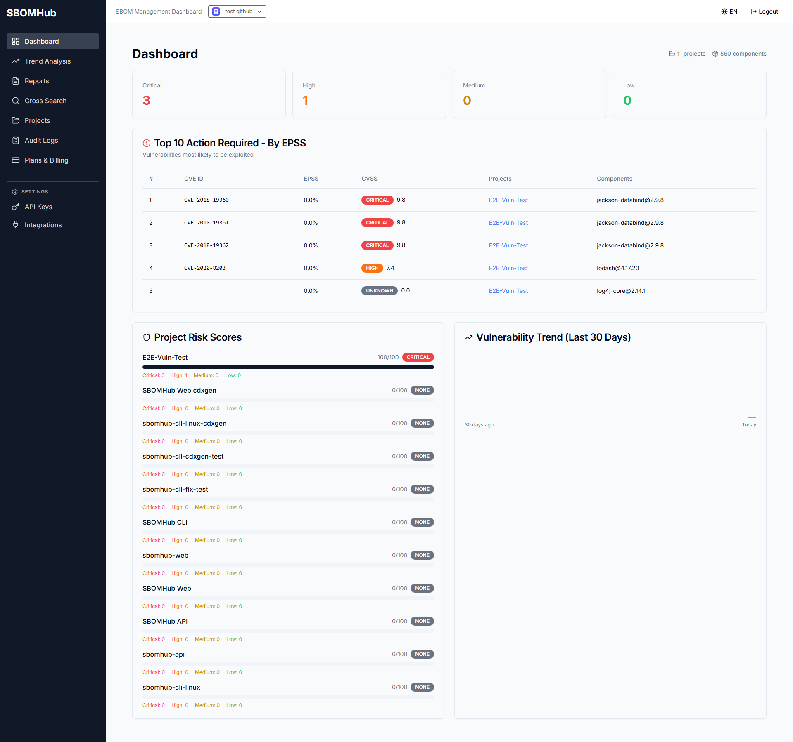

# SBOMHub

[](./README.md) [](./README_en.md)


<p align="center">
  
</p>

## SBOMHub — A CRA-Ready SBOM Compliance Evidence Layer

> **Dependency-Track finds CVEs. SBOMHub turns them into submittable paperwork.**
>
> An AGPL-3.0 open-source workbench that converts SBOMs into approval-ready VEX statements, CRA reports, and audit trails.

## Overview

SBOMHub helps small and mid-sized Japanese manufacturers facing the **EU Cyber Resilience Act (CRA) vulnerability reporting deadline of 11 September 2026** turn raw SBOM and CVE output from Syft, Trivy, or Dependency-Track into actual submission artefacts.

We have stepped away from positioning SBOMHub as "a Japan-flavoured Dependency-Track." It now sits on top of DT / Syft / Trivy as an **AI compliance evidence layer**: AI drafts VEX statements, CRA reports, and METI self-assessments; a human approves them; the result is a document you can hand to a customer, an auditor, or a regulator.

Fully open source under AGPL-3.0. Self-hosted. AI features are **BYOK (Bring Your Own Key)** only — no bundled LLM keys.

## Who is this for?

- **Japanese SMB manufacturers** shipping IoT, embedded, or digital products into the EU
- Teams without a dedicated PSIRT, where developers or QA handle vulnerability response on the side
- Subcontract development shops and small SaaS companies asked by customers to attach SBOM / VEX to deliverables
- Organisations that **cannot send source code or SBOMs to overseas SaaS or external LLM APIs**
- Anyone facing CRA September 2026 with no full-time security headcount

This is not a general-purpose SBOM management tool for everyone. It is a sharp tool aimed at the ICP above.

## Implemented features

| Feature | Description |
|---------|-------------|
| SBOM import | CycloneDX / SPDX JSON |
| Vulnerability correlation | NVD + JVN (Japan) integration |
| EPSS scoring | Exploit probability based prioritisation |
| SSVC | CISA SSVC decision framework |
| KEV integration | Auto-sync of CISA Known Exploited Vulnerabilities catalog |
| VEX (manual) | CycloneDX VEX authoring / editing / export |
| License policies | Allow / deny license enforcement |
| METI self-assessment | METI SBOM-introduction guideline self-check |
| Audit log | Operation history for accountability |
| CI/CD | GitHub Actions examples, API key auth |
| CLI | `sbomhub scan` / `sbomhub check` (sbomhub-cli) |
| MCP Server | Read access from Claude Desktop, Cursor, etc. |
| Multi-tenancy | PostgreSQL Row-Level Security |
| i18n | Japanese / English via next-intl |

## In development (Phase 7: strategy pivot)

Everything below is being built in the open, under AGPL-3.0. Full milestone notes live in `sbomhub-internal/planning/PRODUCT_REBOOT_PLAN.md` (internal).

- **AI VEX triage MVP (M1).** An LLM reads CVE × component × code context and produces a CycloneDX VEX draft. Go and npm ecosystems first. Every output carries confidence, source code evidence, and advisory citations.
- **CRA report drafting (M2).** Drafts for 24-hour early warning, 72-hour detailed notification, and the final report, in Japanese and English. **Never auto-submitted.**
- **METI self-assessment prefill (M3).** CI configs, SBOM scan history, and matching history are turned into "achieved / not achieved / needs review" rows with evidence and remediation suggestions.
- **Local LLM / enterprise self-host polish (M4).** Quality-tune Ollama and friends; ship a hardened self-host security guide.

**Hard rule: AI drafts, humans decide.** SBOMHub will not auto-confirm `not_affected`, and it will not auto-submit CRA reports.

## AI features and BYOK

OSS SBOMHub ships with **no bundled LLM credentials**. Set up a key for one of the providers below — or run a local model — and the AI features turn on.

| Provider | Example model | Code leaves your network? |
|---|---|---|
| OpenAI | `gpt-5` | Yes (BYO key) |
| Anthropic | `claude-opus-4-7` | Yes (BYO key) |
| Google Gemini | `gemini-3.5-flash` | Yes (BYO key) |
| Ollama (local) | `llama3.3`, `qwen2.5-coder` | No (recommended for manufacturers) |

`.env` example:

```bash
# Pick one to enable AI features
SBOMHUB_LLM_PROVIDER=openai            # openai | anthropic | gemini | ollama
SBOMHUB_LLM_MODEL=gpt-5
OPENAI_API_KEY=sk-...

# Local LLM example
# SBOMHUB_LLM_PROVIDER=ollama
# SBOMHUB_LLM_MODEL=qwen2.5-coder:7b
# OLLAMA_HOST=http://localhost:11434
```

If no provider is configured, AI features stay off. Manual VEX authoring, manual CRA paperwork, and manual METI self-assessment continue to work — every non-AI capability of SBOMHub is available without an LLM.

## Quick start

### Docker Compose (self-host, recommended)

```bash
# 1. Pull install.sh and docker-compose.yml (no clone required)
curl -fsSL https://raw.githubusercontent.com/youichi-uda/sbomhub/main/install.sh \
  -o install.sh && chmod +x install.sh
curl -fsSL https://raw.githubusercontent.com/youichi-uda/sbomhub/main/docker-compose.yml \
  -o docker-compose.yml

# 2. One-shot bootstrap:
#    - generates .env (random ENCRYPTION_KEY / MIGRATOR_PASSWORD / APP_PASSWORD),
#    - starts postgres and seeds the sbomhub_app / sbomhub_migrator roles,
#    - brings up api / web / redis.
./install.sh --start

# 3. Open http://localhost:3000
```

For a one-line bootstrap (or the equivalent manual steps as a single source
of truth), see [`docs/snippets/install.sh.md`](./docs/snippets/install.sh.md).

Or clone the repo:

```bash
git clone https://github.com/youichi-uda/sbomhub.git
cd sbomhub
./install.sh                              # generates .env (idempotent)
docker compose up -d --wait postgres      # bring postgres up first
./install.sh --bootstrap-roles            # create sbomhub_app / sbomhub_migrator
docker compose up -d                      # start api / web / redis
```

> `./install.sh` is idempotent: an existing `.env` is left untouched. Re-run with `--force` to back the old file up to `.env.bak.YYYYMMDD` and issue fresh secrets.
>
> **Upgrading from a pre-M0 install**: if you are bringing forward an existing `postgres_data` volume, follow [`docs/UPGRADE.md`](./docs/UPGRADE.md) (DB backup + `./install.sh --bootstrap-roles` to seed the new `sbomhub_app` / `sbomhub_migrator` roles) **before** `docker compose up -d`. Otherwise the api will exit with `password authentication failed`.
>
> **Production**: rotate `ENCRYPTION_KEY` per the runbook at [`docs/encryption-key-rotation.md`](./docs/encryption-key-rotation.md) (90-day cycle recommended).

### CLI (`sbomhub scan`)

Scan and upload directly from your workstation or CI.

```bash
# Install (Homebrew, macOS/Linux)
brew install sbomhub/tap/sbomhub

# Or with Go
go install github.com/youichi-uda/sbomhub-cli/cmd/sbomhub@latest

# Local vulnerability check only (no upload)
sbomhub check .
```

The canonical `login → scan → doctor` flow lives in
[`docs/snippets/cli-quickstart.md`](./docs/snippets/cli-quickstart.md).
Under the hood, the CLI auto-detects Syft, Trivy, or cdxgen. See
[sbomhub-cli](https://github.com/youichi-uda/sbomhub-cli) for details.

### From source

**Prerequisites:** Go 1.22+ / Node.js 20+ / pnpm / PostgreSQL 15+ / Redis 7+

```bash
docker compose -f docker/docker-compose.yml up -d postgres redis
cd apps/api && go run ./cmd/server
# In another terminal
cd apps/web && pnpm install && pnpm dev
```

### About the hosted SaaS

> The hosted version at https://sbomhub.app is **sunset for new signups as of 2026-06-23**. We will reopen it under the new positioning at a later date; the announcement will go through this repository. In the meantime, self-host plus the CLI is the supported path.

## Note for existing users

SBOMHub has pivoted during v0.x from "Dependency-Track for Japan" to "CRA-ready SBOM compliance evidence layer." All shipped features — SBOM management, vulnerability correlation, manual VEX, license policies, METI self-assessment — remain. AI features and CRA reporting are being layered on top.

## Architecture

```
┌──────────────────┐     ┌──────────────────┐
│   Next.js Web    │────▶│     Go API       │
│   (Port 3000)    │     │   (Port 8080)    │
└──────────────────┘     └─────────┬────────┘
                                   │
                ┌──────────────────┼────────────────────┐
                ▼                  ▼                    ▼
        ┌───────────────┐  ┌───────────────┐  ┌─────────────────┐
        │  PostgreSQL   │  │     Redis     │  │   NVD / JVN     │
        │   (Data)      │  │    (Cache)    │  │   (Vuln feeds)  │
        └───────────────┘  └───────────────┘  └─────────────────┘
                                   │
                                   ▼ (BYOK, optional)
                        ┌──────────────────────────┐
                        │   LLM Provider           │
                        │   OpenAI / Anthropic /   │
                        │   Gemini / Ollama        │
                        └──────────────────────────┘
```

## API reference

Core endpoints (see [docs/api.md](./docs/api.md) for the full list).

```
POST   /api/v1/projects              # Create project
GET    /api/v1/projects              # List projects
GET    /api/v1/projects/:id          # Get project

POST   /api/v1/projects/:id/sbom     # Upload SBOM
GET    /api/v1/projects/:id/components
GET    /api/v1/projects/:id/vulnerabilities
GET    /api/v1/projects/:id/vex      # VEX statements

# SSVC
GET    /api/v1/projects/:id/ssvc/defaults
PUT    /api/v1/projects/:id/ssvc/defaults
POST   /api/v1/projects/:id/vulnerabilities/:vuln_id/ssvc
POST   /api/v1/ssvc/calculate

# KEV
POST   /api/v1/kev/sync
GET    /api/v1/kev/:cve_id
GET    /api/v1/projects/:id/kev
```

## MCP Server (read-only)

Surface SBOMHub data inside Claude Desktop, Cursor, and other MCP-compatible AI clients.

```json
{
  "mcpServers": {
    "sbomhub": {
      "command": "node",
      "args": ["/path/to/sbomhub/packages/mcp-server/dist/index.js"],
      "env": {
        "SBOMHUB_API_KEY": "your-api-key",
        "SBOMHUB_API_URL": "http://localhost:8080"
      }
    }
  }
}
```

| Tool | Description |
|------|-------------|
| sbomhub_list_projects | List all projects |
| sbomhub_get_dashboard | Get dashboard summary |
| sbomhub_search_cve | Cross-project CVE search |
| sbomhub_search_component | Component search |
| sbomhub_diff | SBOM diff comparison |
| sbomhub_get_vulnerabilities | List vulnerabilities |
| sbomhub_get_compliance | Get compliance score |

See [packages/mcp-server/README.md](./packages/mcp-server/README.md) for details.

## CI/CD (GitHub Actions)

The canonical workflow snippet lives in
[`docs/snippets/github-actions.yml.md`](./docs/snippets/github-actions.yml.md).
The recommended path is to install `sbomhub-cli` and call `sbomhub scan` in
one step; a raw-`curl` fallback is included for runners where the CLI
cannot be installed.

| Use case                                            | Snippet                                                                          |
|-----------------------------------------------------|----------------------------------------------------------------------------------|
| Full GitHub Actions workflow                        | [`docs/snippets/github-actions.yml.md`](./docs/snippets/github-actions.yml.md)   |
| Equivalent GitLab CI job                            | [`docs/snippets/gitlab-ci.yml.md`](./docs/snippets/gitlab-ci.yml.md)             |
| Single `curl` upload (any runner)                   | [`docs/snippets/curl-upload.md`](./docs/snippets/curl-upload.md)                 |
| CLI three-step flow (local + runner)                | [`docs/snippets/cli-quickstart.md`](./docs/snippets/cli-quickstart.md)           |

All snippets target the canonical upload contract:
`POST /api/v1/projects/:id/sbom` + `Authorization: Bearer sbh_...` + raw
JSON body. The legacy multipart `/cli/upload` route is deprecated with a
2026-09-24 sunset — see [docs/api.md](./docs/api.md) for details.

## Roadmap (Phase 7: strategy pivot)

Counted backwards from CRA 11 September 2026.

| Milestone | Rough duration | Scope |
|---|---|---|
| **M0** Strategy lock-in + Trust Rescue | ~2 weeks | New positioning in README / LP, P0 fixes for RLS / encryption keys / API contracts / CI / distribution, waitlist plumbing, design partner shortlist |
| **M1** AI VEX triage MVP | ~6 weeks | `sbomhub triage` CLI, first-pass reachability for Go / npm, LLM judgement layer, VEX draft store, approve / edit / reject UI, CycloneDX VEX export, confidence + evidence + audit log |
| **M2** CRA report drafting | ~4 weeks | 24h / 72h / final templates, Japanese + English, Evidence Pack assembly |
| **M3** METI self-assessment prefill | ~3 weeks | CI + scan history mapped to METI items with evidence and remediation hints |
| **M4** Local LLM + enterprise self-host polish | Ongoing | LLM provider abstraction, Ollama quality benchmarks, hardened self-host security guide |

Shipped features stay in. New milestones land on top.

## License

This project is licensed under [AGPL-3.0](./LICENSE).

| Use case | OK? | Notes |
|----------|---------|-------|
| Self-host (internal use) | Yes | No source disclosure required |
| Self-host (with modifications) | Yes | Must disclose modified source |
| Provide as SaaS to third parties | Caution | Full source code disclosure under AGPL |

> If you want to embed or resell SBOMHub commercially without AGPL obligations, get in touch about a commercial license.

## Contributing

Contributions are welcome. See [CONTRIBUTING.md](./CONTRIBUTING.md) for guidelines.

If you are interested in the new positioning (CRA, AI VEX, METI self-assessment) or in being a CRA-readiness design partner, open a GitHub Issue or email abyo.software@gmail.com.

## Tech stack

| Layer | Technology | Version |
|-------|------------|---------|
| Backend | Go (Echo v4) | 1.22+ |
| Frontend | Next.js (App Router) | 16 |
| UI | React + shadcn/ui + Tailwind CSS | 19 / latest / 3.4 |
| Language | TypeScript | 5.7 |
| Database | PostgreSQL | 15+ |
| Cache | Redis | 7+ |
| i18n | next-intl | latest |
| Forms | react-hook-form + zod | latest |
| LLM (BYOK) | OpenAI / Anthropic / Gemini / Ollama | Optional |

## Development

### Project structure

```
sbomhub/
├── apps/
│   ├── web/          # Next.js frontend
│   └── api/          # Go backend
├── packages/
│   ├── db/           # DB schema and migrations
│   ├── mcp-server/   # MCP Server (Claude/Cursor integration)
│   └── types/        # Shared TypeScript types
├── docker/           # Docker configurations
├── docs/             # Documentation
└── .github/workflows/  # CI/CD pipelines
```

### Common commands

```bash
# Dev servers
cd apps/web && pnpm dev                # Frontend (http://localhost:3000)
cd apps/api && go run ./cmd/server     # Backend (http://localhost:8080)

# Database
docker compose up -d postgres redis
cd apps/api && go run ./cmd/migrate up

# Test, lint, build
cd apps/api && go test ./... && golangci-lint run
cd apps/web && pnpm test && pnpm lint
docker compose build
```

### Code style

- **Go**: gofmt, golangci-lint
- **TypeScript**: ESLint, Prettier
- **Commits**: [Conventional Commits](https://www.conventionalcommits.org/)

## Security

### Reporting vulnerabilities

If you find a security vulnerability, please use one of the following channels:

1. **GitHub Security Advisories** — [report a vulnerability](https://github.com/youichi-uda/sbomhub/security/advisories/new)
2. **Email** — abyo.software@gmail.com for sensitive issues

Please do not report security vulnerabilities through public GitHub issues.

### Security features

- Row-Level Security (RLS) for multi-tenancy
- API key authentication for CI/CD integration
- HTTPS enforcement in production
- Input validation with zod schemas
- SQL injection prevention via parameterised queries
- BYOK: LLM credentials stay with the operator; SBOMHub ships none

## Acknowledgements

- [CycloneDX](https://cyclonedx.org/) / [SPDX](https://spdx.dev/) — SBOM specifications
- [NVD](https://nvd.nist.gov/) / [JVN](https://jvn.jp/) — Vulnerability databases
- [FIRST EPSS](https://www.first.org/epss/) — Exploit Prediction Scoring System
- [CISA KEV](https://www.cisa.gov/known-exploited-vulnerabilities-catalog) / [CISA SSVC](https://www.cisa.gov/stakeholder-specific-vulnerability-categorization-ssvc)
- [Syft](https://github.com/anchore/syft) / [Trivy](https://github.com/aquasecurity/trivy) / [cdxgen](https://github.com/CycloneDX/cdxgen) / [OWASP Dependency-Track](https://dependencytrack.org/) — input sources we respect and complement
